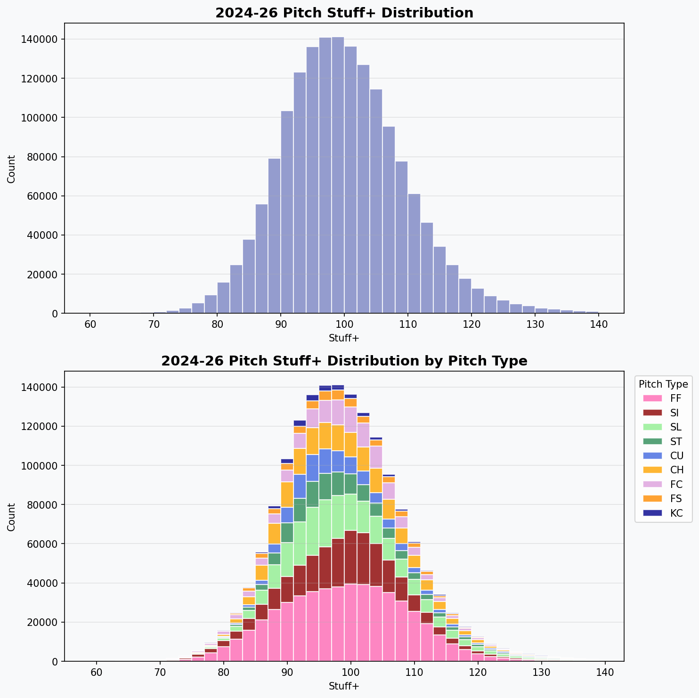
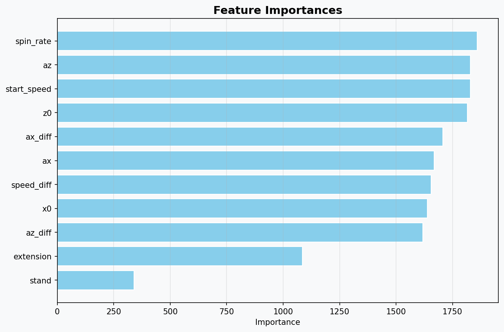

# Stuff+ Model Validation

**Model:** LightGBM | **Trained:** 2024-2025 | **Validated:** 2026

## Features
`release_speed, release_spin_rate, release_extension, ax, az, release_pos_x, release_pos_z, speed_diff, ax_diff, az_diff, stand_enc`

Note: `spin_axis` removed — did not improve predictiveness.

## Validation Results (517 pitchers with 2024+2025 data)

| Metric | Value |
|--------|-------|
| Stickiness (2024 Stuff+ → 2025 Stuff+) | 0.842 |
| Predictiveness (2024 Stuff+ → 2025 wOBA allowed) | -0.342 |
| Predictiveness (2024 Stuff+ → 2025 delta RV) | -0.340 |

## Scaling
- Per-pitch-type normalized (mean=100, SD=10)
- Higher = better stuff

## Charts

